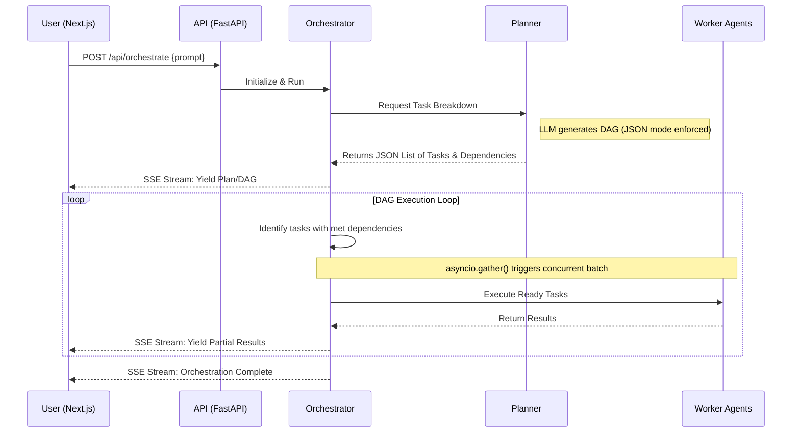

# System Design: Agentic AI Orchestrator

## Overview

When approaching this assignment, my primary goal was to build a system that goes beyond a simple Python script. I wanted to demonstrate a production-ready, full-stack architecture capable of handling asynchronous multi-agent workflows without relying on black-box frameworks like LangChain or CrewAI. 

By building the orchestrator from scratch, I had total control over the Directed Acyclic Graph (DAG) execution, error handling, and data streaming.

### The Stack
*   **Frontend:** Next.js (React), TailwindCSS.
*   **Backend:** Python, FastAPI, `asyncio`, `sse-starlette`.
*   **LLM Provider:** Groq (`llama-3.3-70b-versatile`) chosen specifically for its ultra-low latency inference, which is critical for multi-step agent pipelines.

---

## Data Flow & Execution Pipeline

The core of the system is the `Orchestrator` class, which manages the lifecycle of a user's request. Here is exactly how data moves through the system:

## Key Architectural Decisions

### 1. The DAG and Manual Batching
Instead of executing tasks strictly sequentially, the Planner agent outputs a dependency graph. 
The Orchestrator loops through the pending tasks and filters for tasks where `all(d in completed_tasks for d in task.dependencies)`. 
If it finds multiple independent tasks (e.g., retrieving three different topics), it bundles them into an `asyncio.gather()` call. This manual batching drastically reduces total execution time.

### 2. Server-Sent Events (SSE) vs WebSockets
I chose SSE over WebSockets for the frontend-backend communication. Since the data flow is strictly unidirectional after the initial POST request (backend streaming progress to frontend), WebSockets would have been overkill and introduced unnecessary state management overhead. SSE is lighter, natively supported by HTTP/1.1, and perfectly handles the progressive rendering of the UI.

### 3. Enforced JSON Mode (Preventing Hallucinations)
A major point of failure in custom AI systems is the LLM returning malformed JSON (like trailing commas or markdown blocks). To solve this, I strictly enforced Groq's `response_format={"type": "json_object"}` at the API level for the Planner. This guarantees 100% valid DAG structures and prevents the orchestrator from crashing due to parsing errors.

### 4. Real Tool Calling
To prove true agentic behavior, the `Retriever` agent doesn't just hallucinate facts from its training data. It extracts the core search query and uses Python's native `urllib` to hit the live Wikipedia API, extracting real-world data to feed into the DAG context. If the network call fails, it gracefully falls back to internal LLM knowledge.

---

## Failure Handling

I built defense-in-depth mechanisms to handle the realities of networking and LLM volatility:
*   **Exponential Backoff:** If the Groq API throws a 429 (Rate Limit) or 503, the `BaseAgent` catches it and retries up to 3 times with exponential backoff before failing.
*   **Deadlock Detection:** If the Orchestrator's while-loop detects that there are pending tasks but none of them are ready to execute, it immediately halts and streams a Deadlock Error rather than hanging infinitely.
*   **Frontend Stream Buffering:** Large LLM outputs get chopped into partial network chunks. I implemented a robust byte-buffer on the Next.js side that intercepts these chunks, waits for the `\r\n\r\n` delimiter, and safely reconstructs the payload before attempting `JSON.parse`.
