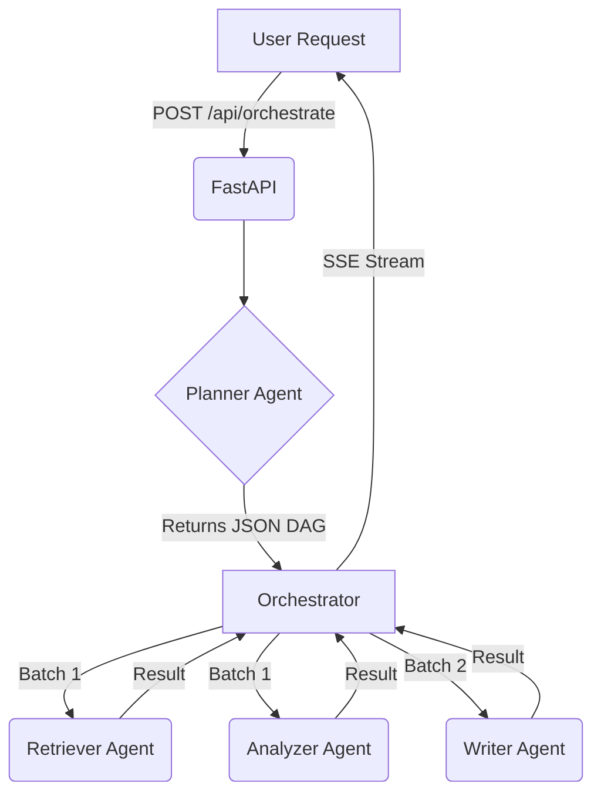

# System Design: Agentic AI System

## Architecture Overview

This system is built using a custom Python backend (FastAPI) and a Next.js frontend, communicating via Server-Sent Events (SSE). It eschews black-box frameworks in favor of a bespoke asynchronous execution engine that demonstrates deep understanding of LLM orchestration.

### Components

1.  **Frontend (Next.js + Tailwind)**: Provides a premium UI. It submits the user request and listens to the SSE stream to visualize the Directed Acyclic Graph (DAG) of tasks and agent outputs in real-time.
2.  **Backend API (FastAPI)**: Exposes the `/api/orchestrate` endpoint. It initiates the orchestrator loop as a background task.
3.  **Planner Agent**: Uses a rigid system prompt and JSON parsing to decompose the user's prompt into a set of discrete tasks (TaskDef) with dependencies.
4.  **Specialized Agents (Retriever, Analyzer, Writer)**: Individual agents with specific system prompts. They execute tasks concurrently based on the dependency graph.
5.  **Orchestrator Engine**: The core of the system. It:
    - Evaluates the DAG.
    - Manually batches independent tasks using `asyncio.gather`.
    - Handles context injection from completed tasks to dependent downstream tasks.
    - Yields state changes (Planning, Executing, Completed, Error) to the SSE stream.

## Data Flow

## Failure Handling

-   **Exponential Backoff**: BaseAgent implements a retry loop with exponential backoff for transient API failures.
-   **Structured Parsing**: PlannerAgent explicitly strips markdown formatting and uses `json.loads`. If it fails, it raises an exception that the orchestrator catches and streams back to the UI.
-   **Deadlock Detection**: The orchestrator checks if pending tasks cannot be resolved due to circular or missing dependencies, preventing infinite hangs.
